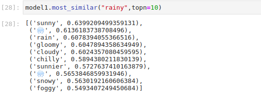

# **Don't talk🤐, Emoji it.**

By Vince Pan

-----------------

# Table of Contents📝

[1. Background](#motivation)  
[2. Data](#DATA)  
>   [2.1. Source](#DATA) 
>   [2.2. EDA](#EDA) 

[3. Model](#model)
>   [3.1. Tuning](#tuning) 
>   [3.2. Ensemble](#ensemble) 

[4. Go Live](#app)
>   [4.1. Dash App](#app) 
>   [4.2. Feedback collection](#feedback) 

[5. Summary](#sm)

[6. Appendix](#Appendix)

-----------------------
# Background

## Motivation

> Originating on Japanese mobile phones in 1997, Emoji became increasingly popular worldwide in the 2010s after being added to several mobile operating systems.

In 2020-01-29, the most recent version Emoji 13.0 was released with 117 new Emojis which sum up to 3,304 Emojis in total.

Although 3,000 doesn't seem like a big number, Emojis have rich meanings and easily understood by people from different backgrounds. For instance, here is an example of behavior guidelines under COVID-19.

👑🦠            (Coronavirus)

* 🚫🤦          (Don't touch your face)
* 🚫🤧🤲        (Don't sneeze into hands)
* ✅🤧💪        (Do sneeze into your elbow)
* 🧼🖐⏲        (Wash your hands regularly)
* 🚇😷🛒        (Wearing a mask in public)

Above Emoji sentences are easy to read and understood by people with different cultural backgrounds. However, it is not easy to come up with the correct Emojis you can use to express yourself concisely.

## Goal

Our objective is to provide a solution to translate sentences from English to Emojis.

## Project Setup

The idea underneath is we can let the machine learn from how people use Emoji on the internet and compare it with how they use English words. If they use a specific Emoji and a certain word in the same situation, we believe they are substitutable.

We are going to use a two-layer Nereul Network called **Word2Vec** and build two models based on CBOW and Skip-gram. After that, we tuned the models by comparing our predicting result with a ground truth dataset from web-scraping and ensemble them together to achieve the final model.

The model will be applied on an AWS EC2 instance in the form of a Web App done with Dash. The app also collects user feedback into the SQL database which able us to adjust the model regularly.

**Workflow**

----------------

# DATA

## Source

### Twitter Data

There are various internet platforms like Facebook, Twitter, Instagram, where people heavily using Emojis to make friends, chitchat, and express their feelings. Here we utilized a **Twitter** dataset collected millions of tweets that contain at least one Emoji.

* Original Site: Twitter
* Feature: Only text content

Sample Tweet

> That’s awesome! Plus you’re a Meredith Angel!!😇🤗😉

> Happy Birthday 🎊❤️

**Data Source** See [Appendix - Data Source](#DataSource)

### Ground Truth

The usage of a Ground Truth in building a translator is to benchmark how well you predict which also develops the metrics for comparing models.

Our Ground Truth data was web scraping from various Emoji websites which has their own Emoji meanings.

For example, ☁️ in Emojipedia.com has 3 meanings

> Cloud, Cloudy, Overcast

We web scraped the meanings for all Emojis and set it as our Ground Truth data(Sometimes Ground Truth Knowledge). We say the prediction is correct if the translate "cloud" to ☁️. The accuracy metric we use later designs as how many percentages of words in the Ground Truth data was predicted correctly.

**Ground Truth** See [Appendix - Ground Truth Source](#GTS)

## EDA

Let's take a quick look at the data.

* Size: 18,866,900 records
* 11.1 words per tweet
* 3.8 Emoji per tweet*
* 2,890 Unique Emojis

Note: Multiple Emoji connected with each other without space treated as one word

| Word_1 | Word_2 ... Word_(n-1) | Word_n |
|:------:|:-------------------:|:------:|
|   9%   |         31%         |   59%  |

Most Emojis come in the last word of a tweet.

😂 is not only the most frequent Emoji but also has a higher frequency than any English words including "the".

> Fun fact: Oxford Dictionaries named 😂 as 2015 Word of the Year.

# Model

The technique we use in this model is called **Word2Vec** which is a two-layer Nereul Network. 

> Word2vec is a group of related models that are used to produce word embeddings. These models are shallow, two-layer neural networks that are trained to reconstruct linguistic contexts of words. Word2vec takes as its input a large corpus of text and produces a vector space, typically of several hundred dimensions, with each unique word in the corpus being assigned a corresponding vector in the space. Word vectors are positioned in the vector space such that words that share common contexts in the corpus are located close to one another in the space. -Wikipedia

In short, it vectorizes word(corpus) into numerical vectors by exploring the relationship between a target word and the neighborhood words(window). After that, we can find out the most similar Emoji and English words.

For instance, 

We could use the most similar Emoji ☁️ to represent the English word "cloudy".

## Tuning

The word2vec model was developed by Google and easy to run in various language environments. However, it is not a straight forward work to do well. 

In python, `work2vec` was built in the Gensim package. Here is part of the tunning history of our model in a small sample.

| Sample | Algorithm |       Tuning Feature       | accuracy |
|:------:|:---------:|:--------------------------:|:--------:|
|  small |  baseline |                            |    7%    |
|  small |    CBOW   | Default                    |    14%   |
|  small |    CBOW   | size:100 to 300            | +1%      |
|  small |    CBOW   | min_count: 10 to 5         | +2%      |
|  small |    CBOW   | window: 3 to 8             | +2%      |
|  small |    CBOW   | window: 8 to 16            | -1%      |
|  small |    CBOW   | ...                        |          |
|  small |    CBOW   | New punctcation            | +1%      |
|  small |    CBOW   | **Remove Stemmer**             | **+3%**      |
|  small |    CBOW   | **seperate connect Emoji**     | **+6%**      |
|  small |    CBOW   | Best Tuned in Small Sample | 31%      |
| ...    | Skip-gram | ...                        | ...      |
| Full   |    CBOW   | Best Tuned                 | 53%      |
| Full   | Skip-gram | Best Tuned                 | 49%      |
    
We can see there is about 40% improvement from the first model to the latest tuned version. This Word2Vec is not only sensitive to hyperparameters but also to the text processing step.

## Ensemble

We can see above models tuning history, the CBOW and Skip-gram are two algorithms we can adopt in the Word2Vec model which have similar scores. The difference between them is that CBOW is using the neighborhood to predict target work while skip-gram on the opposite.

The difference between them makes them tend to predict common words(CBOW) and rare words(Skip-gram) which can be seen if we weighted our accuracy by word frequency. There is a famous quote in Chinese.

> Only kids make choice. Adults get both.

Ensembling could help us with that. The idea of ensemble models is we can merge two bad models into a fairly well model. The way we ensemble these two model by a threshold determine which word should be frequent and rare.

The final Model recorded 62% accuracy in predicting the Ground Truth, higher than any single model, and improved 55% compared to baseline(7%).

----------------

# Go Live<a id="app">

## Dash App

We use the `pyDash` package to develop an HTML interface for user type in input and receive output. Dash was built on Python Flask which allows us to load any python model without converting language.

Here is output when we published our beta version on an AWS EC2 machine.

## Feedback Collection<a id="feedback">

What makes a good model different from a great model is that a great model can improve itself. In the content of translation, user feedback could be our great resource. We create a section under the translation output.

That submission would immediately insert into a table in our SQL server on AWS.

----------------

# Summary

## Takeaway

* Not limited to the original meaning, people use Emoji creatively, for instance, the Emoji 🍆 is often used in flirting. 
* Tuning in the text processing steps is as crucial as tuning model hyperparameter in this NLP analysis.
* The ensemble method is a solution to make bad predictors into a better one when advanced methods are not applicable. (RNN text generator requires TB level memory since we had 3000 more characters which usually 26+10)

## What is next

* Word base model is not smart enough when people using phrases. Word2Vec will not be suitable if we create 2-gram or 3-gram since it required super high computation power and memory. Discovering more text processing skills might be helpful in this task.
* Incorporate user feedback to update the model. There are many ways of applying user feedback to fix the model. Multi-bandit which is a good choice when we have a stable traffic volume.

----------------------------------------

# Appendix

**Data Source**

- **EmojifyData-EN: English tweets, with Emojis**

    source: https://www.kaggle.com/rexhaif/Emojifydata-en Collected by Daniil Larionov
    
- **Ground Truth Data Source**

    * Emojipedia: https://Emojipedia.org/

    * Hot Emoji: https://hotEmoji.com/Emoji-meanings.html
    
    * Emojis Wiki: https://Emojis.wiki/
    
    * EmojiTerra: https://Emojiterra.com/
    
    * The Ultimate Emoji Guide: https://Emojiguide.org/

